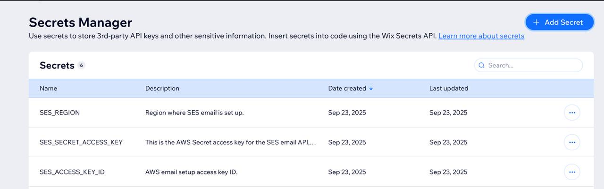

# GGG Email - AWS SES Integration

This repository demonstrates how **Global Guide Group** migrated its transactional email system from **SendGrid** to **Amazon SES (Simple Email Service)**. 
 
This project mirrors the structure of our earlier SendGrid demo but swaps in AWS SES using the official API route.

## Why the Migration?

- **Cost Efficiency**: SES offers pay-as-you-go pricing, far cheaper than SendGrid's plans for low to medium volume.  
- **Scalability**: SES is enterprise-grade and scales seamlessly with AWS infrastructure.  
- **Security**: IAM policies + Secrets Manager keep credentials safe (no API keys hard-coded).  
- **Future-Proofing**: SES is reusable across projects, reducing reliance on third-party SaaS.  

This repo is a **companion** to [GGG Email - SendGrid](https://github.com/WIALTD/sendgrid-email-demo), showing how the system evolved.

### AWS SES Dashboard (Verified Domain)


---

## Tech Stack

- **Backend**: Wix Velo (with Node.js)  
- **Email Service**: Amazon SES API  
- **Secrets Manager**: Wix Secrets Manager for secure credential storage  

### DKIM Verification Success


---

## Project Structure

```
ggg-email-ses/
├── .env.example          # Example of required secrets
├── .gitignore
├── Index.js              # Example entry point
├── package.json
├── sesEmail.jsw          # Wix backend email sender (SES API)
└── assets/               # Screenshots of SES + Wix Secrets setup
```

---

## Assets

This repo includes an `/assets` folder that contains supporting screenshots and configuration examples:  

- **ses-dashboard.png** – AWS SES console showing verified domain + sandbox limits.  
- **dkim-success.png** – Confirmation of DKIM verification for domain.  
- **wix-secrets-manager.png** – Wix Secrets Manager setup, demonstrating secure storage of SES keys.  

These are included for **portfolio/visa documentation purposes** to illustrate the real-world configuration steps alongside the code.

---

## Data Contract

The frontend form, backend proxy, and Lambda **must agree on field names**.  
After debugging, we standardised the following schema:

| Field             | Form ID        | CMS Key          | Lambda Payload Key |
|-------------------|----------------|------------------|--------------------|
| First Name        | `#firstName`   | `firstName`      | `clientName` (part of full name) |
| Last Name         | `#lastName`    | `lastName`       | `clientName` (part of full name) |
| Email (Client)    | `#userEmail`   | `email`          | `clientEmail` |
| Destination Dates | `#destinationDates` | `destinationDates` | `destinationDates` |
| Message           | `#message`     | `message`        | `message` |

✅ **Lesson learned**: originally, mismatches (`userMessage` vs `message`) caused blank emails. Fixed by aligning names.

---
## Frontend (Wix Page Code)

Key points:
- Reads form field values directly (`#firstName`, `#lastName`, etc.)  
- Calls `sendSesEmail()` **before saving CMS**, so an email is always attempted.  
- Saves CMS record independently (`GuideMessages` collection) to avoid blocking.  
- Handles errors gracefully: email failure doesn’t block saving, CMS failure doesn’t block sending.

```js
import { sendSesEmail } from 'backend/sesEmail.jsw';

export async function button5_click(event) {
  $w('#button5').disable();

  const firstName = $w('#firstName').value;
  const lastName = $w('#lastName').value;
  const clientEmail = $w('#userEmail').value;
  const destinationDates = $w('#destinationDates').value;
  const message = $w('#message').value;

  const guide = $w('#dynamicDataset').getCurrentItem();
  const guideName = guide.title || "Guide";
  const guideEmail = guide.emailAddress;

  // Send SES email first
  await sendSesEmail({
    to: guideEmail,
    subject: `New Tour Request for ${guideName}`,
    replyTo: clientEmail,
    data: { guideName, clientName: `${firstName} ${lastName}`, clientEmail, destinationDates, message }
  });

  // Save CMS record second
  $w('#dataset2').setFieldValues({
    guide: guide._id,
    guideEmail,
    firstName,
    lastName,
    email: clientEmail,
    destinationDates,
    message
  });

  await $w('#dataset2').save();
  $w('#button5').enable();
}
```

---
## Backend (Wix JSW)

Acts as a proxy to Lambda.
Keeps SES logic out of the frontend, protects secrets, and ensures consistent payload formatting.

```js

// backend/sesEmail.jsw
import { fetch } from 'wix-fetch';

const LAMBDA_URL = "https://xxxxx.lambda-url.us-east-1.on.aws/";

export async function sendSesEmail({ to, subject, data, replyTo }) {
  const res = await fetch(LAMBDA_URL, {
    method: "POST",
    headers: { "Content-Type": "application/json" },
    body: JSON.stringify({ to, subject, replyTo, ...data }),
  });

  if (!res.ok) throw new Error(`Lambda returned ${res.status}`);
  return res.json();
}
```

## Lambda (AWS)

- ** Receives payload from Wix backend
- ** Formats HTML + plain text body
- ** Sends via AWS SES (verified domain + DKIM configured)
- ** Supports reply-to client email

```js

import { SESClient, SendEmailCommand } from "@aws-sdk/client-ses";

export const handler = async (event) => {
  const { to, subject, replyTo, guideName, clientName, clientEmail, destinationDates, message } = JSON.parse(event.body);

  const client = new SESClient({ region: "us-east-1" });

  const htmlBody = `
    <h2>New Tour Request for ${guideName}</h2>
    <p><b>From:</b> ${clientName} (${clientEmail})</p>
    <p><b>Destination & Dates:</b> ${destinationDates}</p>
    <p><b>Message:</b><br>${message}</p>
    <hr/>
    <small>This request was sent via Global Guide Group.</small>
  `;

  const textBody = `
New Tour Request for ${guideName}
From: ${clientName} (${clientEmail})
Destination & Dates: ${destinationDates}
Message: ${message}
  `;

  const command = new SendEmailCommand({
    Destination: { ToAddresses: [to] },
    Message: {
      Subject: { Data: subject },
      Body: {
        Html: { Data: htmlBody },
        Text: { Data: textBody },
      },
    },
    Source: "hello@globalguidegroup.com",
    ReplyToAddresses: replyTo ? [replyTo] : [],
  });

  await client.send(command);
  return { statusCode: 200, body: JSON.stringify({ success: true }) };
};

```

## Secrets Manager Setup (Wix)



AWS SES requires an **Access Key ID** and **Secret Access Key** for API calls.  
For security, these credentials are **never hard-coded** in the project. Instead:  

1. Create three entries in Wix Secrets Manager (`SES_ACCESS_KEY_ID`, `SES_SECRET_ACCESS_KEY`, and`SES_REGION`). 
2. Reference them in backend code using `wix-secrets-backend`.  
3. This mirrors best practices in production: sensitive credentials live in encrypted storage, not in your repo.  

```js
import { getSecret } from 'wix-secrets-backend';

export async function sendSesEmail(to, subject, htmlBody, textBody) {
  const accessKeyId = await getSecret("SES_ACCESS_KEY_ID");
  const secretAccessKey = await getSecret("SES_SECRET_ACCESS_KEY");
  // ... SES client logic
}
```

## Frontend Integration (Wix)

Once the backend SES Lambda was working, we connected it to a Wix frontend form.  
This included:

- Pulling guide data dynamically from the CMS
- Building a SES payload with client + guide info
- Saving a record in the `GuideMessages` CMS collection
- Redirecting users to a `/request-thank-you` page after submit
- Showing a pulsing "loading overlay" while the CMS save + SES relay happen

### Code Sample (button5_click)
```js
// shortened snippet of the Wix frontend button handler
export async function button5_click() {
  showLoadingOverlay();
  try {
    const result = await sendSesEmail({ ... });
    await $w('#dataset2').save();
    wixLocation.to("/request-thank-you");
  } catch (err) {
    console.error(err);
  } finally {
    hideLoadingOverlay();
  }
}
```

## Usage

1. Copy `.env.example` → `.env` and fill in your SES keys + region.  
2. Store these values in **Wix Secrets Manager** instead of hardcoding them.  
3. Import and call `sendSesEmail()` from your Wix frontend code.  

Example call:

```js
import { sendSesEmail } from 'backend/sesEmail';

$w.onReady(function () {
  sendSesEmail("hello@globalguidegroup.com", "Test Subject", "<p>Hello World</p>", "Hello World")
    .then(res => console.log(res))
    .catch(err => console.error(err));
});
```

## Debugging Journey

- **  Form vs CMS IDs: Wix form element IDs (#userMessage) ≠ CMS field keys (message). Must align.
- **  Independent flows: Sending email and saving CMS separately avoids dual failure risk.
- **  Reply-to field: Confirmed SES supports it; guides can reply directly to clients.
- **  Formatting: Lost custom SendGrid templates, but SES now delivers full text + HTML bodies. Custom html templates can be saved in SES codebase. 

⸻

## Lessons Learned

This project was not a simple “SES integration.” It became a demonstration of **end-to-end problem solving** and structural architecture strategic decisions.

### 1. Wix vs. AWS Lambda

- **Initial attempt**: Run SES directly in Wix backend using the AWS SDK.  
- **Problem**: Wix sandboxing + dependency issues made SES calls brittle and hard to debug.  
- **Solution**: Offloaded SES calls to an AWS Lambda function. Wix simply relays JSON payloads to the Lambda endpoint, which is purpose-built for SES. This separation made the architecture **simpler, more stable, and more maintainable**.

### 2. CORS & Permissions

- Encountered CORS rejections when calling Lambda from Wix.  
- Fix: Explicitly allow `POST` (and `OPTIONS`) on the Lambda Function URL. Once configured, communication was reliable.  
- Takeaway: **Infrastructure quirks** (like CORS) can block progress more than code itself.

### 3. Data Mapping & Field Consistency

- Mismatch between **Wix form field IDs** (e.g. `userMessage`) and **CMS collection keys** (e.g. `message`) caused missing values in emails.  
- Fix: Standardized names across frontend form, dataset, backend, and Lambda templates.  
- Lesson: **Schema consistency matters** — every layer must agree on field names.

### 4. Templates & Styling

- Original SendGrid setup used hosted templates with styled fonts (Cormorant Garamond).  
- SES requires building templates manually (HTML + plain text).  
- For MVP, minimal styling was accepted. But the migration illustrates trade-offs: SES is cheaper and more flexible, but requires more DIY effort compared to SendGrid’s polished tooling.

### 5. Architectural Choice: Independent Workflows

- **Old flow**: Form submit → CMS save → trigger email.  
- **New flow**: Form submit triggers **two independent actions**:  
  1. Call Lambda to send SES email immediately.  
  2. Save to CMS for recordkeeping.  
- Rationale: **Reduce failure points**. If CMS save fails, email still sends (and vice versa). This separation increases reliability.

### 6. Debugging & Logging

- Extensive use of `console.log` (Wix) and CloudWatch (Lambda) was essential to trace failures.  
- Key insight: Even with a simple API call, **debugging infrastructure integration requires visibility across all systems**.

---

**Outcome:**  

What started as a frustratingly complex migration ended up being a **portfolio-grade demonstration of real-world problem solving**: working across SaaS limitations, cloud infrastructure, frontend/backend integration, and schema alignment. This journey was documented at least in part to illustrate how you can drive yourself nuts over tiny details if not paying 1000% attention at every moment. Anyways. It works. And it works brilliantly.  


## License

MIT
