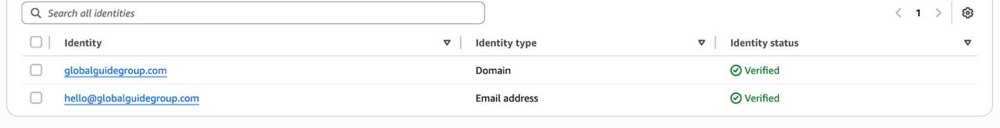
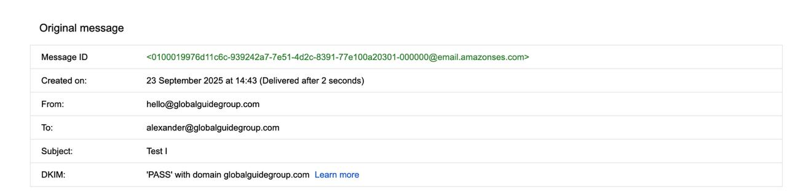

# GGG Email - AWS SES Integration

This repository demonstrates how **Global Guide Group** migrated its transactional email system from **SendGrid** to **Amazon SES (Simple Email Service)**.  
This project mirrors the structure of our earlier SendGrid demo but swaps in AWS SES using the official API route.

## Why the Migration?

- **Cost Efficiency**: SES offers pay-as-you-go pricing, far cheaper than SendGrid's plans for low to medium volume.  
- **Scalability**: SES is enterprise-grade and scales seamlessly with AWS infrastructure.  
- **Security**: IAM policies + Secrets Manager keep credentials safe (no API keys hard-coded).  
- **Future-Proofing**: SES is reusable across projects, reducing reliance on third-party SaaS.  

This repo is a **companion** to [GGG Email - SendGrid](https://github.com/WIALTD/sendgrid-email-demo), showing how the system evolved.

### AWS SES Dashboard (Verified Domain)


---

## Tech Stack

- **Backend**: Wix Velo (with Node.js)  
- **Email Service**: Amazon SES API  
- **Secrets Manager**: Wix Secrets Manager for secure credential storage  

### DKIM Verification Success


---

## Project Structure

```
ggg-email-ses/
├── .env.example          # Example of required secrets
├── .gitignore
├── Index.js              # Example entry point
├── package.json
├── sesEmail.jsw          # Wix backend email sender (SES API)
└── assets/               # Screenshots of SES + Wix Secrets setup
```
---

## Usage

1. Copy `.env.example` → `.env` and fill in your SES keys + region.  
2. Store these values in **Wix Secrets Manager** instead of hardcoding them.  
3. Import and call `sendSesEmail()` from your Wix frontend code.  

Example call:

```js
import { sendSesEmail } from 'backend/sesEmail';

$w.onReady(function () {
  sendSesEmail("hello@globalguidegroup.com", "Test Subject", "<p>Hello World</p>", "Hello World")
    .then(res => console.log(res))
    .catch(err => console.error(err));
});

## License

MIT
